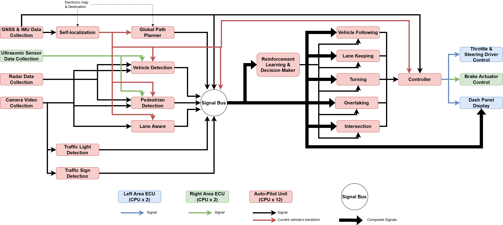
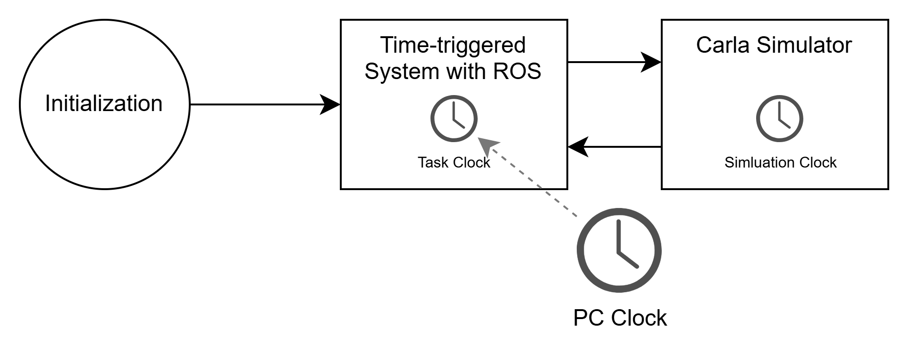

# Time-Triggered-System-Dataset
This dataset group was generated by an Autonomous Driving (AD) simulation application based on a multi-core time-triggered scheduling system. They are primarily used for event and related attribute prediction in time-triggered systems. Each time we run the simulation, a new dataset is generated. Therefore, the name of the dataset corresponds to the time of its generation. The model in our paper is trained on the dataset from "2024.07.15 15h29m36s". Feel free to cite our paper: \<not published yet\>

For a dataset, the most important issue is how to efficiently and quickly read the data. Therefore, in the beginning, I provide a simple Python code example to help you quickly retrieve the five sub-datasets and the event attribute name list. The event attribute names correspond one-to-one with the features in the event attribute dataset 'attr'. Next, I will provide a detailed explanation of our simulation and the dataset.

- [Get Dataset Quickly](#get-dataset-quickly)
- [Autonomous Driving Simulation Based On Multi-processer Time-triggered Scheduling System](#autonomous-driving-simulation-based-on-multi-processer-time-triggered-scheduling-system)

 
# Get Dataset Quickly
First, let me introduce the directory of our dataset files. After extracting the dataset zip file, you will obtain a dataset folder with the following directory structure:

```plaintext
2024.07.15 15h29m36s.zip/
├── Data Set Check/     # Data check folder.
│   ├── Data            # Data used for the report file.
│   ├── Figures         # Figures used for the report file.
│   ├── Models          # Typically empty.
│   ├── PathDic.json    # Vechicle trajectory data used for the report file.
│   └── Report.pdf      # The simulation report file for showing results and
|                       # checking the dataset. 
├── Config.json         # Simulation configuration file, including the parameters
|                       # of task, event, message, and time-triggered system.
├── FGC.csv             # Filtered dataset
├── GlobalContext.csv   # Raw dataset generated from the simulation directly.
├── subdataset.npy      # Sub-dataset dictionary that can be used directly.
├── system_dataset.csv  # CPU utility dataset
└── README.md           
``````
The contents of the 'Data Set Check' folder include the simulation results and the dataset evaluation results. These are automatically summarized in the Report.pdf file after the simulation run is completed. Since our time-triggered scheduling system is simulated on a server with RT-Linux kernel, rather than being a real-time triggered system, we must evaluate the generated data to avoid using datasets with severe violations of the schedule. At the end of this file, there are two test results: Start Time Error Test and End Time Error Test. A severe error occurs if a task is started before its dispatch time specified in the schedule. If the delay is too long, it will also trigger a severe error. A severe error will occur if a task’s execution time exceeds the WCET (Worst-Case Execution Time). The error data calculated in these two tests will be displayed in two graphs, and any error messages will be listed below the graphs, if available. Due to other software running on the Linux system, some scheduling errors may occur, which cannot be completely avoided. Therefore, we consider a dataset usable as long as the number of severe errors is not too high, and the error results are not too severe. Note: The usability of a dataset is subjectively determined by us. Therefore, we include the evaluation results in our dataset to help readers independently judge whether they want to use it.

All the simulation parameters are included in the 'Config.json' file, which lists all the tasks, messages, events, and other simulation parameters. This file generally does not change, but as we continue to update our simulation software, this file will undergo corresponding changes.

The 'GlobalContext.csv' file is directly generated by our simulation. The 'FGC.csv' file is a reordered version of the dataset, and its data section is identical to that of 'GlobalContext.csv'. Note: Our simulation usually has missing or anomalous data in the first and last scheduling cycles. Therefore, if you plan to use the 'FGC' file directly, please remove the data from the first and last scheduling cycles. The 'subdataset.npy' file contains five sub-datasets. It is the result of splitting the data from 'FGC' based on functionality, with the data from the first and last scheduling cycles removed. For example, in the '2024.07.15 15h29m36s.zip' dataset, the 'FGC' file contains data for 6905 scheduling cycles, while the 'subdataset.npy' file contains data for 6903 scheduling cycles.

Here, a Python code example is provided to help you retrieve the 5 sub-datasets.

```python
import numpy as np
# Please use the dataset path after unziping
datasetPath = "<the dataset path>"

# obtian 5 sub-datasets from subdataset.npz file
subdatasetPath = os.path.join(datasetPath, "subdataset.npz")

# load dataset dictionary
_subdataset = np.load(subdatasetPath)

# example for showing you how to obtain these 5 sub-datasets and
# create your own sub-dataset dictionary.
subdataset = {'header':_subdataset['header'],
              'task':_subdataset['task'],
              'event':_subdataset['event'],
              'attr':_subdataset['attr'],
              'cpu':_subdataset['cpu']}

# show their shape             
print(subdataset['header'].shape,
      subdataset['task'].shape,
      subdataset['event'].shape,
      subdataset['attr'].shape,
      subdataset['cpu'].shape)

# show the name of event attributes
attrNameList = list(_subdataset['attr_name'])
print(attrNameList)

# create prefix (data) sequence and suffix (label) sequence based on them
# ...
``````

# Autonomous Driving Simulation Based On Multi-processer Time-triggered Scheduling System

## Carla Simulator
Carla Simulator is an open-source simulation platform designed for developing AD systems. It provides a highly realistic environment for testing autonomous vehicles. Furthermore, it provides Python APIs and several AD examples.

Homepage: https://carla.org/

GitHub: https://github.com/carla-simulator/carla

## Robot Operating System (ROS)
ROS is an open-source framework for developing robotic applications. In our application, ROS plays a role as a communication system.

Homepage: https://wiki.ros.org/noetic

## Autonomous Driving Simulation & Computational Load
We've expanded a simulation example of Carla Simulator into a multi-processor time-triggering system. In this example, only the autonomous driving functionality based on the data from the simulation environment is implemented. We want to add a variety of sensors to make the whole system more realistic. Therefore, we refer to the tear-down report of the Tesla Model 3 (https://www.eetimes.com/a-tesla-model-3-tear-down-after-a-hardware-retrofit/). Since we don't have access to the functional modules of the software part, we can only design them ourselves based on the web descriptions and our understanding. However, AD simulation isn't our main job. Our main goal is to build an AD simulation based on a multi-processor time-triggered system to obtain event logs. The message dependency diagram of the AD simulation application we designed is as follows:



This AD simulation consists of 21 tasks and 32 events. We refer to the design of Tesla Model 3 and the hardware situation of our server to configure the number of CPU cores, a total of 14 cores. There are three independent computing units, and the number of CPU cores in each unit is different. Moreover, the tasks assigned to each unit cannot be executed in other units. In order to get as close to the real situation as possible, we added a "computational load" (actually a "sleep" function) to each task to consume time.

There are 4 sensor data collection tasks: "GNSS & IMU Data Collection", "Ultrasonic Sensor Data Collect", "Radar Data Collection", and "Camera Video Collection" tasks. These sensor data can be obtained directly from Carla Simulator's APIs. However, in practice, this sensor data takes time to acquire. Therefore, we configured the basic computational load for each sensor task. Since 
some "sensors" have a long sampling period, their sensor data can be accessed every several scheduling cycles. We configured periodic computational loads for the "GNSS & IMU Data Collection" and "Camera Video Collection" tasks so that the execution time of these two tasks varies periodically. Moreover, their sensor data are only available periodically. The periods of these two tasks are 5 seconds and 10 seconds, respectively. We also take into account the loss of sensor data. Every sensor task has a certain probability, albeit low, of losing data.

There are 3 actuator tasks: "Throttle & Steering Driver Control", "Break Actuator Control", and "Dash Panel Display". They only have a fixed computational load.

The remaining 14 tasks are logical computing tasks. They are responsible for the implementation of the different functional modules. However implementing each of these modules is unfeasible for us, and it is not our original purpose. For example, the "Vehicle Detection" task is responsible for identifying and classifying surrounding vehicles and estimating their location by fusing data from radar, ultrasonic, and camera. This requires the cooperation of multiple machine learning algorithms and deep learning models. Furthermore, it requires a lot of time and resources to design and train models. Fortunately, we can access all vehicle information directly through the APIs provided by the Carla Simulator. Therefore, the idea is that we don't really need to implement the functionality of these modules, but rather restore the input and output streams of these modules as much as possible and make the computation time seem reasonable. For example, the "Vehicle Detection" task is implemented as follows: we take the location of all vehicles through APIs and then calculate their distance from the vehicles we control. If the distance of a vehicle is within a detecting range, then the information will be appended to the output list of this task. Although the output has nothing to do with these input data, they affect the execution time of the task. Because sensor data are not always accessible due to periodicity and data loss, old data may be used for multiple scheduling cycles. In such a situation, we assume that additional time is needed to estimate the current data based on the old one. The execution time of other logical computing tasks is also adjusted based on the current task inputs.

## Time System
Carla Simulator is developed using the Unreal Game Engine. Although Carla Simulator presents realistic 3D renderings, the simulation process is not real-time. Since the 3D rendering time is affected by a variety of factors, such as the number of objects in the picture and the complexity, the corresponding real-world rendering time is variable. Therefore, we separated the scheduling system from the simulation process and designed a separate time system for them. Carla Simulator provides an API that allows the simulator to perform a simulation for a specified simulating time period. Thanks to this API, we can separate them. The two systems are executed alternately, as shown in the following diagram:



After initializing the simulation environment and scheduling system parameters, the scheduling system begins to execute the first scheduling cycle. Some parameters of the simulation environment are dynamically configured during this process, rather than just task execution (so the data for the first scheduling cycle of the event log needs to be discarded). When all tasks are completed, the task clock will be paused. Then start the rendering of the first simulation tick. We set each tick to 20ms simulation time. The simulation clock automatically starts timekeeping. When the simulation ends, the simulation clock is automatically paused. Finally, each task sends its own event list to the master node to generate an event log. This will be detailed in the next section. This is the end of the first scheduling cycle. The next scheduling cycle will then be triggered by the scheduler, and the task clock will resume. When all tasks are executed, the task clock will pause again. This process can be simply described as the alternation of the scheduling system and the simulation system. These two clocks also alternate until the vehicle we control reaches the destination or reaches the maximum execution time. When the simulation application starts, the PC clock starts to count until the whole simulation is completed. It is not affected by simulation systems and scheduling systems. Each event will contain information from these 3 clocks. I've taken a screenshot of the event log and presented the time data in the graph below.


The task clock is synchronized with the PC clock, but only when the scheduling system is running. As you can see from the diagram above, the relationship between the task clock and the PC clock is a straight line. The simulation clock is not directly related to the PC clock, but is controlled by the simulation environment. We set the simulation time of a tick to 20ms, so it takes very little time to render. From this graph, you can see that the task clock and the simulation clock are counted alternately. At the end of each scheduling cycle, there is a period of time when both clocks stop counting, where the local event lists are transmitted to the masker node.

## Local Context & Global Context


